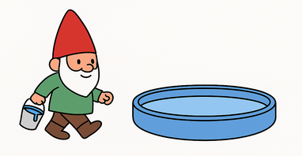
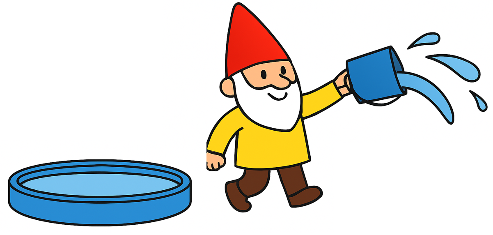
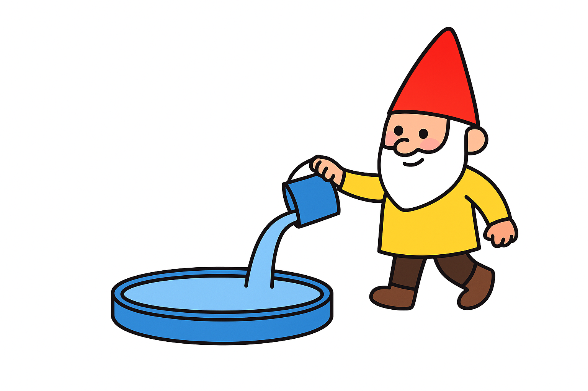
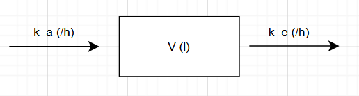
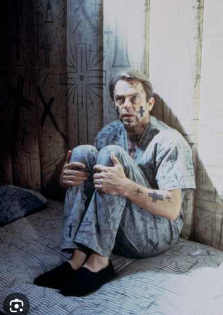

## (L)ADME: the Journey of a Drug

```{r}

source(here::here("inst","EgisStatPres","gnomes_dyes.R"))
source(here::here("inst","EgisStatPres","pkprofils.R"))


```

-   Every drug molecule follows a **pharmacokinetic pathway** often summarized as **(L)ADME**

    -   **L**: Liberation — release of the active substance from its formulation

    -   **A**: Absorption — entry from the site of administration into systemic circulation

    -   **D**: Distribution — reversible transfer among plasma, tissues, and organs

    -   **M**: Metabolism — enzymatic transformation into metabolites (often hepatic)

    -   **E**: Excretion — elimination of parent drug and metabolites (renal, biliary, etc.)

-   These processes determine **exposure** (*Concentration*–*time* profile) and thereby **response**.

------------------------------------------------------------------------

## Visualizing the (L)ADME Process

```{r}
#| label: fig-ladme
#| echo: false
#| fig-cap: "(L)ADME schematic: concentrations over time reflecting sequential processes."
time <- seq(0,24,0.1)
L <- dgamma(time, shape=2, rate=0.8) * 1.2
A <- L * exp(-0.3*time)
D <- 1.2*A * exp(-0.1*time)
M <- 0.6*A * (1 - exp(-0.4*time))
E <- 0.2*M * exp(-0.2*time)
matplot(time, cbind(L,A,D,M,E), type="l", lwd=3, lty=1,
        col=c("gray40","black","red3","blue3","forestgreen"),
        xlab="Time (h)", ylab="Relative amount / concentration",
        main="Sequential phases of (L)ADME")
legend("topright", legend=c("Liberation","Absorption","Distribution","Metabolism","Excretion"),
       col=c("gray40","black","red3","blue3","forestgreen"), lty=1, cex=0.8)

```

## Note on Models

-   In the *natural sciences* we model our environment — we *make a stand–in world* which is simpler than the real one.\
-   We deliberately **discard** detail. We keep only simplified structures.\
-   With several of these candidate systems we **choose** the one which is the best for our purposes.
-   And then we explore that simplified world **as if it were** the real one — because it is *easier* to think inside that reduced world.

> **“All models are wrong, but some are useful.”** (G.E.P. Box)

So what we work with is not “the truth”, but rather we use an **instrument** to have important realizations.

------------------------------------------------------------------------

## What remains of (L)ADME

```{r}

source(here::here("inst","EgisStatPres","gnomes_dyes.R"))
source(here::here("inst","EgisStatPres","pkprofils.R"))


```

-   Every drug molecule follows a **pharmacokinetic pathway** often summarized as **(L)ADME**

    -   ~~**L**: Liberation — release of the active substance from its formulation~~

    -   **A**: Absorption — entry from the site of administration into systemic circulation

    -   ~~**D**: Distribution — reversible transfer among plasma, tissues, and organs~~

    -   **M** **& E** handled together

-   These processes determine **exposure** (*Concentration*–*time* profile) and thereby **response**.

## Setup, Step 1 — Our Pool & Two Gnomes (Sequential)

:::::: columns
::: {.column width="33%"}
-   We have a **Pool** (volume (V)) in a garden, initially clear.\
-   At time (**t=0**), *Blue Gnome* dumps dye.
-   The pool is **instantly** colored proportional to the *concentration* of the dye in the pool water.
-   (*Blue Gnome* has a finite supply of dye and always dumps *half* of his supply in one go.)
:::

::: {.column width="33%"}
{height="200px"}
:::

::: {.column width="33%"}
```{r fig.height = 12}
#| echo: false
# first time point only (we haven't shown elimination)

fig_1


```
:::
::::::

## Step 1b — Drain Gnome Exchanges a Bucket

:::::: columns
::: {.column width="38%"}
-   At **(t=1)** the **Yellow Gnome** removes a **bucket** of pool water and replaces it with **clear** water.\
-   **Volume stays constant**, but the **dye fraction falls** → concentration drops.\
-   This is our first *elimination* action: a tiny step down from (C_0).
:::

::: {.column width="32%"}
{height="125px"}

{height="150px"}
:::

::: {.column width="30%"}
```{r}
#| echo: false
#| fig.height: 12

fig_2

```
:::
::::::

## Step 2 — Repeat

:::::: columns
::: {.column width="38%"}
-   We repeat the previous step
-   *Blue Gnome* brought less dye this time
-   *Yellow Gnome* filters water which is "bluer" this time
-   The *Voume* of the pool is the same
:::

::: {.column width="32%"}
{height="300px"}
:::

::: {.column width="30%"}
```{r}
#| echo: false
#| fig.height: 12

fig_3

```
:::
::::::

## "All" steps

:::::: columns
::: {.column width="38%"}
-   Repeat these steps 10 times
-   The supply of dye is *practically exhausted* by the end
-   The water can never get *completely* clear
:::

::: {.column width="32%"}
{height="300px"}
:::

::: {.column width="30%"}
```{r}
#| echo: false
#| fig.height: 12

fig_4

```
:::
::::::

## Reducing time step

:::::: columns
::: {.column width="38%"}
-   Make the Gnomes *faster* but keep the amount of their work *constant* (per hour).
-   Using *"supersonic"* Gnomes we arrive at a curve.
:::

::: {.column width="32%"}
{height="300px"}
:::

::: {.column width="30%"}
```{r}
#| echo: false
#| fig.height: 12

fig_5

```
:::
::::::

## Getting abstract

::::: columns
::: {.column width="69%"}
-   Make the Gnomes *faster* but keep the amount of their work *constant* (per hour).
-   Using *"supersonic"* Gnomes (tiny steps) we arrive at a curve.
-   The **rate constant** or the *speed* of the gnomes could be phrased as:
    -   if the same amount of *dose* would be *absorbed* for an hour as in this instant, what *fraction* of dose would be absorbed?
    -   if the same amount of the *pool/compartment* would be *cleared* for an hour as in this instant, what fraction of the *pool/compartment* would be *absorbed*?

{height="150px"}
:::

::: {.column width="30%"}
```{r}
#| echo: false
#| fig.height: 12

fig_5

```
:::
:::::

## Model vs. reality

To reiterate, don't expect the model to fit reality, which is usually much more complex.

::::: columns
::: {.column width="50%"}
{height="450px"}
:::

::: {.column width="49%"}
{height="450px"}
:::
:::::

## Observations

-   We can (usually) only observe the concentrations at discrete times
-   Deviations from the expectations can stem from (at least):
    -   Measurement errors
    -   Intercurrent physical activity / state
    -   Faster / Slower *individual* absorption/clearence
    -   Other factors....

```{r, fig.height = 6}

fig_6

```

## Estimating parameters

-   We should try to *minimize* the sum total of squared deviations.
-   We are looking for the parameter trio *V*, $k_a$, $k_e$ with whom this value is minimal.

$$
f(V, k_a, k_e)
  \;=\;
\sum_{i=1}^{n} \bigl( C_{\text{obs},i} - C_{\text{model}}(t_i \mid V, k_a, k_e) \bigr)^2
$$

```{r, fig.height = 6, fig.width=19}

fig_7

```

## Objective function

-   We can see the **value** of the objective function against the different values of the parameters
-   We should call an **optimizer** algorithm which (*reliably*) finds the **absolute minimum** value (with as *few steps* as possible)
-   The theory and especially the practice is problematic because the effect of the parameters are **nonlinear**

```{r}

fig_8

```

## Results in this case

-   For this profile, the *green* curve minimizes the deviation of the model from the real values.
-   This is only for this specific profile (after 1 dosing).
-   **Population pharmacokinetics** aims to analyze data from several profiles using *these kinds* of models.

```{r}

fig_9

```

<!-- ## Impact of parameter changes -->

<!-- ```{r} -->

<!-- fig_10 -->

<!-- ``` -->

## Dissolution's link

- Dissolution testing is a staple of *in vitro* development
- This is in line with the thinking that different *formulations* could potentially effect absorption, but not elimination
- Dissolution testing aims to simulate the *liberation* & *absorption* of the API from the formulation in different locations in the GI tract
- If this model holds, it could help predict in $C_{max}$ and up to a point AUC.

```{r}

fig_14

```


## Lognormal changes

-   **Allometry** describes a **power rule** for these kinds of parameter distributions at least with regards to size [(link)](https://www.science.org/doi/10.1126/science.276.5309.122).
-   For these parameters *at least some* influencing factors are multiplicative (eg. $V = V_0 * mass^{0.75}$) - these result in **lognormal deviations**.
-   *Even if* we only allow a normally-distributed body mass to influence **V**, extreme values start to appear.

```{r, fig.width=19}

fig_11_Vonly_spaghetti

```

## Lognormal changes (2)

-   Even in this simple model, variability could be introduced for $k_a$ and $k_e$ as well; also $C_{max}$ isn't directly observable.
-   For the below example the variability is **`r inter_cv`%**.

```{r, fig.width=19}

fig_13

```


## What *is* a lognormal distribution?


:::::: columns
::: {.column width="49%"}
-   If we have a variable which is **lognormally** distributed, it means that the **ln()** transformed variables would be **normally** distributed.
-   In practice this means that a *"handful* of such variables would be *"pretty big"*

:::
::: {.column width="50%"}
```{r}
#| echo: false
#| fig.height: 12

fig_15

```
:::
::::::


## Why lognormal?

-   Physiology scales in **percent changes**

-   many multiplicative influences stack up (97% $\times$ 119% $\times$ 68% $\times$ 96%....)

-   product of many little random effects ⇒ lognormal

```{r, fig.width=19}

## simulate 20 multiplicative factors
set.seed(11)

N   <- 1000
K   <- 20

# K independent effects, normal(0,0.2)
# NOTE: these are *additive in log-space*
mat <- matrix(rnorm(N*K, mean=0, sd=0.20), nrow=N, ncol=K)

# rowwise *multiplicative* product
prod_vec <- exp(rowSums(mat))

df <- data.frame(prod_vec = prod_vec*100)

library(ggplot2)

ggplot(df, aes(prod_vec)) +
  geom_histogram(bins = 60, colour="black", fill="grey70") +
  theme_minimal(base_size = 14) +
  labs(x="resulting product (% change)",
       title="Product of 20 small random log-effects → lognormal")


```


## Plotting on the log scale 

- A real-life problem is when *log()* transforming is that *$log(0)=NA$*
- Add a small value (*$\delta$*) to every observation (eg. 1% of the 5th percentile or 0.1)


```{r}

fig_12c

```


## Noncompartmental Analysis (NCA): why do we do it

-   mechanistic models are powerful but assumption-rich
-   real PK datasets: \~18–24 sampling points per subject
-   often too few points to safely “fit” all compartments
-   the "correct" model is not generally definable (different drugs behave differently)
-   therefore we compress the **large** time series into a \***handful** of interpretable summary numbers
-   this is noncompartmental analysis (it doesn't rely on compartments)

## What NCA extracts

-   $C_{max}$ (peak observed value) - generally tied to absorption
-   $t_{max}$ (time of peak)
-   AUC (area under curve) – numeric integration of the curve - tied to exposure
-   terminal slope (lambda_z) → half-life
-   these describe *parts of the shape* without committing to a structure

## How to think about NCA

-   goal: **dimension reduction** with **biological interpretability**
-   NCA values are not parameters of a model (one less layer of abstraction)
-   they are useful stable summaries of the curve shape
-   2 profiles with the same Cmax + AUC feel “similar” in broad terms even if their ka/ke or number of "true" compartments differ
-   NCA gives a compact basis to *compare treatments / formulations / subjects* in a **concrete** and **generalizable** way

## Intra-subject changes

- Using NCA we end up with a handful of **log-normally distributed** *$C_{max}$* and *AUC* values
- **If** there are some which were obtained from the **same subject** after different setups (dosing different products, at different times, different ways etc.), we can estimate the *intra-subject* variability
- This always depends on the *context* of the study at hand

$$
\mathrm{ISCV} \;=\; \sqrt{ \exp(s_w^2) - 1 },\quad s_w^2 \;=\; \frac{\mathrm{Var}(d_i)}{2},\quad d_i = \log(C_{i,B}) - \log(C_{i,A})
$$


```{r, fig.width=18}

fig_16

```


## Stuff needed for sample size calculation

- The sample size is a deterministic function of:

  - The design
  - The Power (80% or 90%)
  - The Dropout rate (0%-30%, usually 10%)
  - The point estimate (T/R, theta, usually 0.95)
  - The ISCV
  
- We need **all** input parameters 


